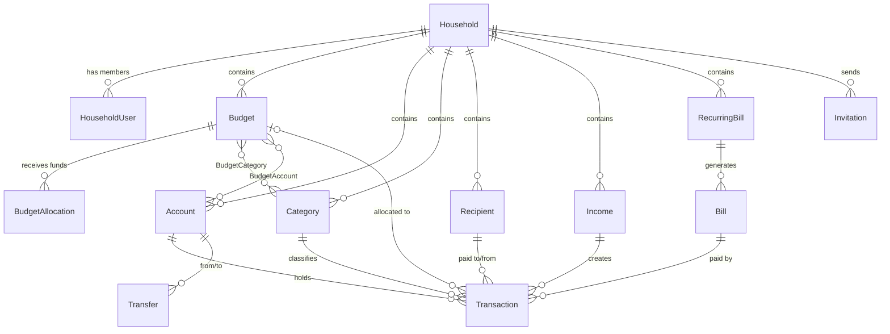
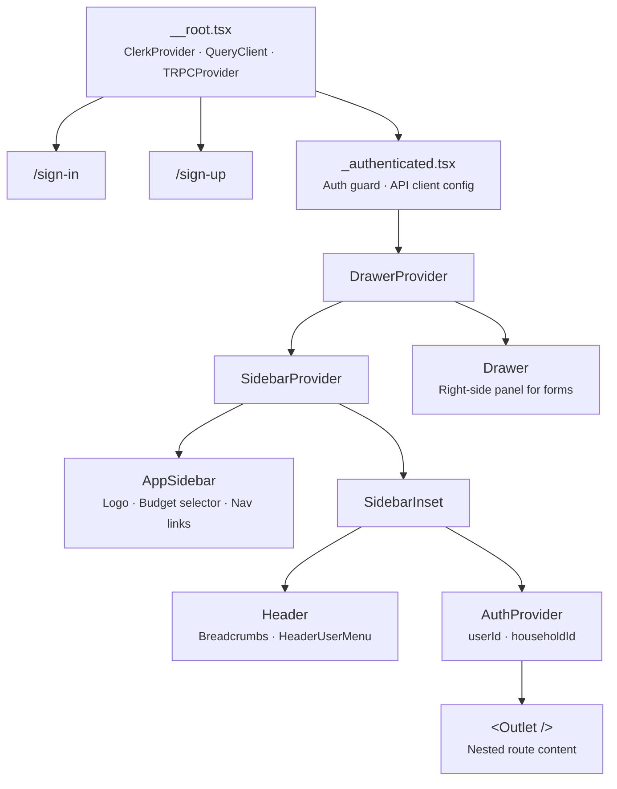
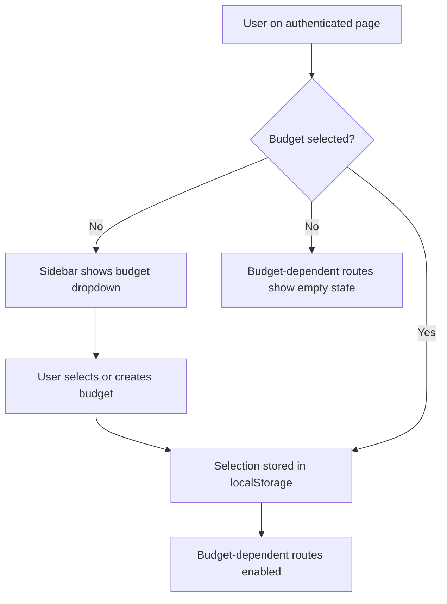
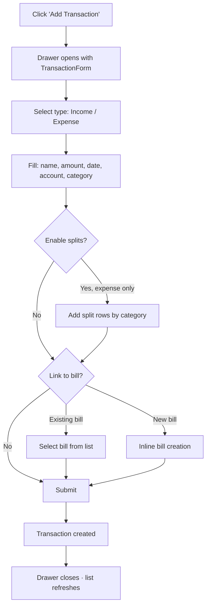
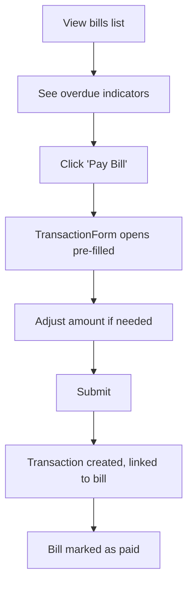
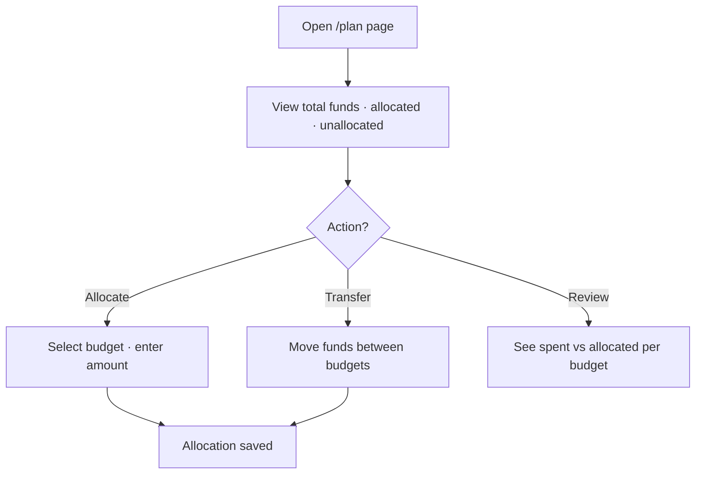

# Project Yoshi — Application Overview

A household budget management application built with TanStack Start, React 19, and TypeScript. Users can manage multiple households, track income and expenses, plan budgets, pay bills, and visualize financial health over time.

## Tech Stack

| Layer | Technology |
|---|---|
| Framework | TanStack Start (SSR, file-based routing) |
| UI | React 19, shadcn/ui, Tailwind CSS v4 |
| Forms | TanStack Form + Zod validation |
| Data fetching | TanStack Query (migrating from tRPC to REST via OpenAPI) |
| Auth | Clerk (email/password + SSO) |
| Database | PostgreSQL via Prisma |
| i18n | i18next (Swedish locale) |
| Tooling | Vite, Biome, Vitest |

## Data Model

All entities are scoped to a **Household**. A user can belong to multiple households and switch between them at runtime.



### Key entities

| Entity | Purpose |
|---|---|
| **Household** | Top-level tenant. All data is scoped here. |
| **HouseholdUser** | Join table linking users to households (multi-tenancy). |
| **Budget** | A spending plan with a start date. Linked to categories and accounts. |
| **BudgetAllocation** | Funds allocated to a budget for a given period. |
| **Account** | A financial account (bank, cash, etc.) with an initial balance. |
| **Category** | Labels for transactions. Tagged as `INCOME`, `EXPENSE`, or both. |
| **Transaction** | An income or expense entry tied to an account, category, budget, and optionally a bill or income source. |
| **Transfer** | Moves funds between two accounts. |
| **RecurringBill** | A bill template with a recurrence schedule. |
| **Bill** | A specific instance of a recurring bill. |
| **Income** | A recurring income source definition. |
| **Recipient** | A payee or payer, shared across transactions. |
| **Invitation** | Email-based invitation to join a household. |

### Enums

- **CategoryType**: `INCOME`, `EXPENSE`
- **RecurrenceType**: `NONE`, `WEEKLY`, `MONTHLY`, `QUARTERLY`, `YEARLY`, `CUSTOM`

## Route Structure

```
/sign-in                    Public — Clerk sign-in
/sign-up                    Public — Clerk sign-up
/sign-in/sso-callback       Public — SSO redirect handler
/sign-up/sso-callback       Public — SSO redirect handler

/_authenticated             Layout — sidebar, header, drawer, auth guard
  /                         Dashboard — balance chart, account summaries
  /transactions             Transaction list — filter, create, edit, clone, delete
  /income                   Recurring income — manage sources, create transactions
  /plan                     Budget allocation — allocate & transfer funds
  /bills                    Bills — pay, split, archive, recurrence
  /categories               Category management — link to budgets
  /budgets                  Budget list — CRUD
  /budgets/$budgetId        Budget detail — quick actions
  /accounts                 Account management — link to budgets

/api/trpc/$                 API — tRPC endpoint handler
```

## Component Hierarchy



## User Flows

### Authentication

```mermaid
flowchart TD
    A[User visits app] --> B{Authenticated?}
    B -->|No| C[Redirect to /sign-in]
    C --> D{Sign-in method}
    D -->|Email/Password| E[Clerk sign-in form]
    D -->|SSO| F[SSO provider redirect]
    F --> G[/sso-callback — loading]
    E --> H[Clerk issues JWT]
    G --> H
    H --> I[Redirect to /]
    B -->|Yes| I

    I --> J{Household selected?}
    J -->|No| K[Show NoHousehold component]
    K --> L[Create or accept invitation]
    L --> M[Household stored in localStorage]
    J -->|Yes| M
    M --> N[App ready — show dashboard]
```

### Budget Selection

Many features (transactions, bills, income, plan) require an active budget. The budget selector lives in the sidebar.



### Transaction Creation



### Bill Payment



### Budget Planning



## State Management

| Concern | Mechanism |
|---|---|
| Server data (lists, entities) | TanStack Query with automatic cache invalidation after mutations |
| Auth tokens | Clerk `getToken()` injected into API client on mount |
| Household selection | `localStorage` + React context (`AuthProvider`) |
| Budget selection | `localStorage` + React context (`useSelectedBudget`) |
| Form state | TanStack Form (per-form instance, Zod validation) |
| Drawer open/close | React context (`DrawerProvider`) |

## API Layer

The project is **migrating from tRPC to a standalone REST API**.

| Component | Status |
|---|---|
| OpenAPI spec (`src/api/luigi.yaml`) | Defined |
| Generated REST SDK (`src/api/generated/`) | Generated via `@hey-api/openapi-ts` |
| API client config (`src/api/client-config.ts`) | Configured with Clerk auth |
| Hook factories (`src/hooks/api/`) | Still using tRPC — migration target |
| tRPC router (`src/integrations/trpc/`) | Active, to be replaced |

The generated SDK provides typed functions, Zod schemas, and TanStack Query hooks for every endpoint in the OpenAPI spec.

## Key Patterns

- **Household-scoped multi-tenancy** — all data belongs to a household; users switch households at runtime.
- **Drawer-based forms** — create/edit flows open in a right-side drawer panel instead of page navigations or modals.
- **Inline entity creation** — combobox fields allow creating new categories and recipients without leaving the current form.
- **Split transactions** — expenses can be split across multiple categories.
- **Recurring items** — bills and income support recurrence schedules (weekly, monthly, quarterly, yearly, custom).
- **Archive over delete** — bills and income can be archived rather than permanently deleted.
- **Automatic query invalidation** — mutations invalidate related queries so the UI stays fresh.
- **File-based routing** — TanStack Router derives the route tree from the filesystem under `src/routes/`.
