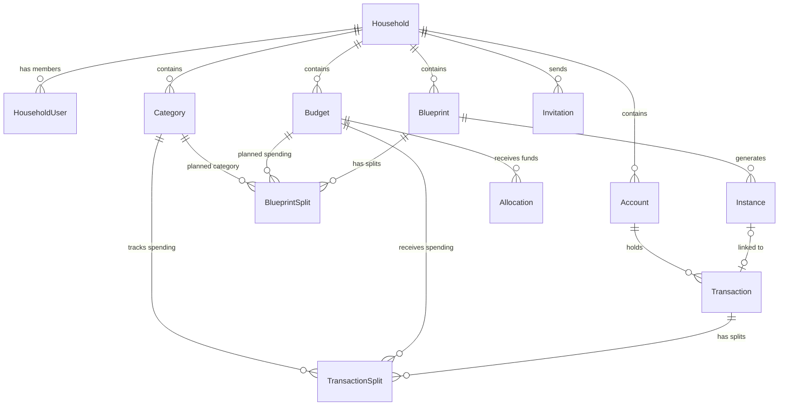
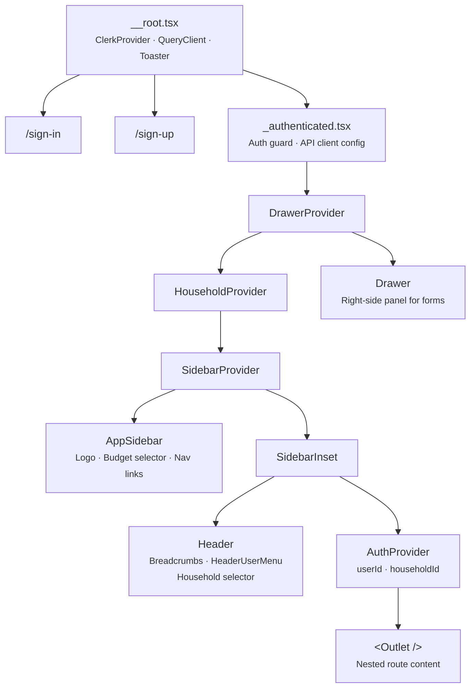
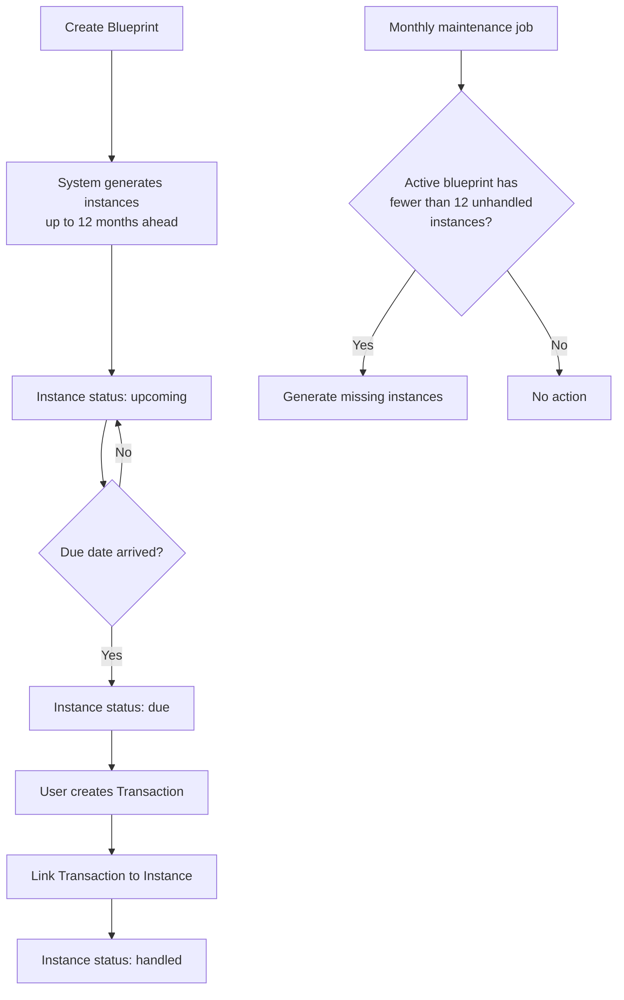
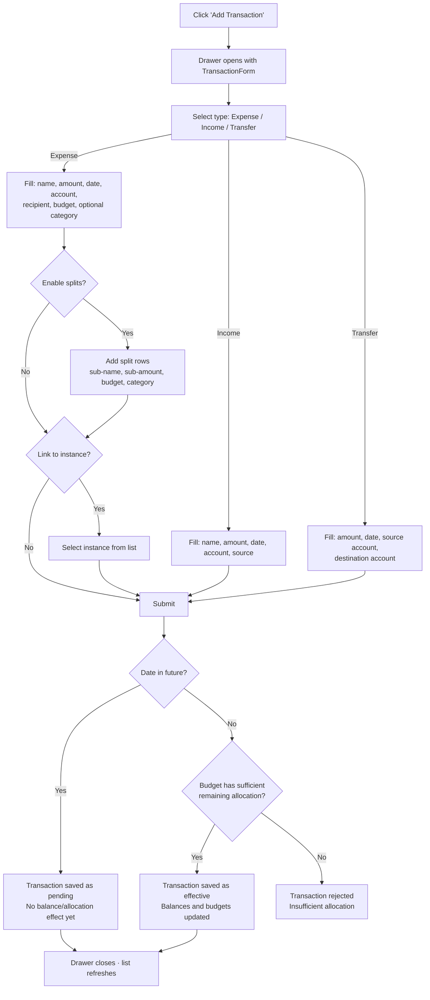
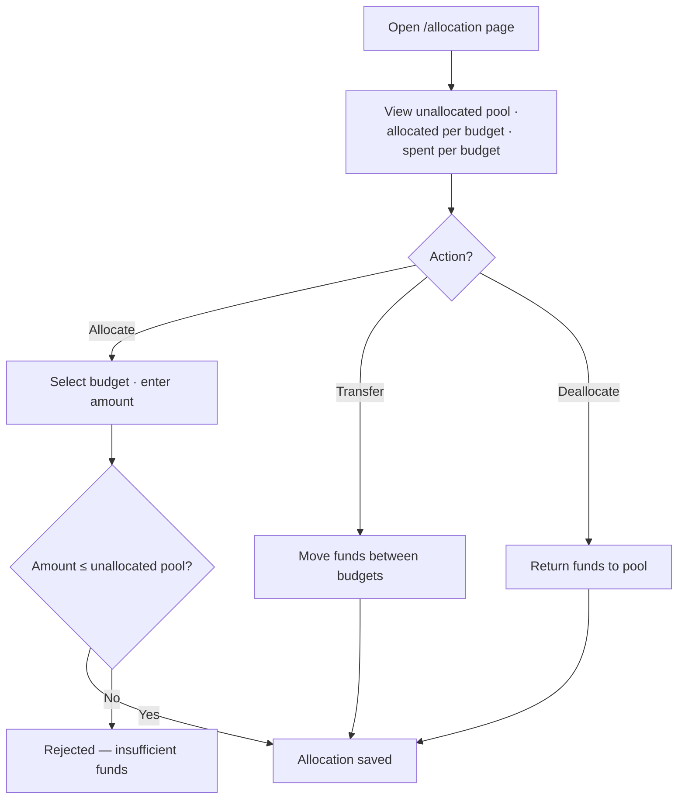
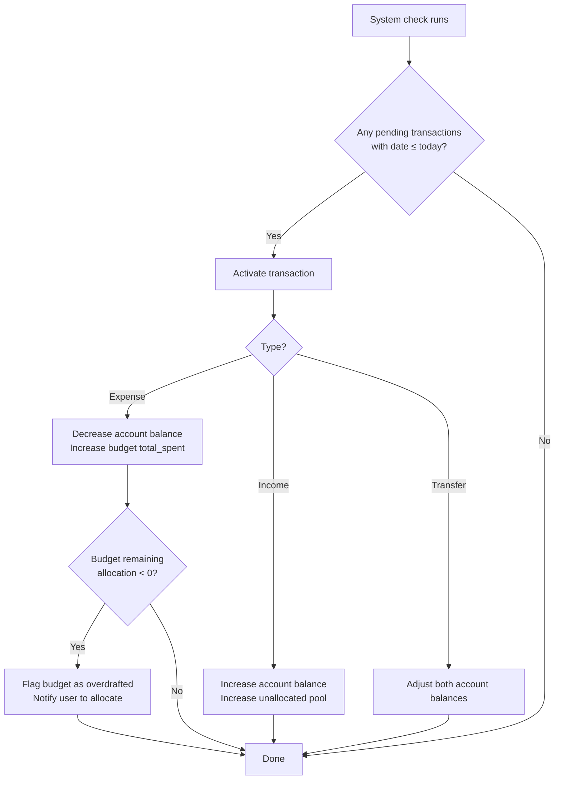

# Project Yoshi — Application Overview

A household budget management application built with TanStack Start, React 19,
and TypeScript. Users can manage multiple households, track income and expenses,
allocate funds into budget envelopes, and track bills and income using a
Blueprint → Instance → Transaction model.

See also: [Project Brief](./docs/PROJECT_BRIEF.md) ·
[User Stories](./docs/USER_STORIES.md)

## Tech Stack

| Layer          | Technology                                          |
| -------------- | --------------------------------------------------- |
| Framework      | TanStack Start (SSR, file-based routing)            |
| UI             | React 19, shadcn/ui, Tailwind CSS v4                |
| Forms          | TanStack Form + Zod validation                      |
| Tables         | TanStack Table                                      |
| Data fetching  | TanStack Query + generated REST client from OpenAPI |
| State          | TanStack Store                                      |
| Auth           | Clerk (email/password + SSO)                        |
| Backend        | External backend API (OpenAPI-driven contract)      |
| i18n           | i18next (Swedish locale)                            |
| Charts         | Recharts                                            |
| Date utilities | date-fns                                            |
| Tooling        | Vite, Biome, Vitest                                 |
| Mocking        | MSW (Mock Service Worker)                           |
| Compiler       | React Compiler (babel plugin)                       |

## Data Model

All entities are scoped to a **Household**. A user can belong to multiple
households and switch between them at runtime.



### Key Entities

| Entity               | Purpose                                                                                                          |
| -------------------- | ---------------------------------------------------------------------------------------------------------------- |
| **Household**        | Top-level tenant. All data is scoped here.                                                                       |
| **HouseholdUser**    | Join table linking users to households (multi-tenancy).                                                          |
| **Account**          | A financial account (bank, cash, etc.) with a name, external identifier, and initial balance. Archivable.        |
| **Budget**           | An envelope that holds allocated money for a spending purpose. Tracks `total_allocated` and `total_spent`.       |
| **Category**         | A global label (household-scoped, not budget-scoped) for granular spending tracking. Usable across all budgets.  |
| **Blueprint**        | A definition of a recurring or one-time bill or income. Generates instances based on recurrence rules.           |
| **BlueprintSplit**   | A sub-line on a bill blueprint, splitting the total across budgets and optional categories.                      |
| **Instance**         | A single expected occurrence of a blueprint at a specific date. Statuses: `upcoming`, `due`, `handled`.          |
| **Transaction**      | The single source of truth for money movement. Types: `expense`, `income`, `transfer`.                           |
| **TransactionSplit** | A sub-line on a transaction, splitting the total across budgets and optional categories.                         |
| **Allocation**       | A record of funds moved from the unallocated pool into a budget (or between budgets, or back to the pool).      |
| **UnallocatedPool**  | A derived value: sum of all effective income transactions minus sum of all allocations. Not a stored entity.     |
| **Invitation**       | Email-based invitation to join a household.                                                                      |

### Entity Properties

**Account**
- `id`, `name`, `external_identifier`, `initial_balance`, `current_balance`,
  `archived`

**Budget**
- `id`, `name`, `total_allocated`, `total_spent`

**Category**
- `id`, `name`, `archived`

**Blueprint**
- `id`, `name`, `type` (bill | income), `recurrence` (one_time | weekly |
  monthly | yearly | custom), `start_date`, `end_date` (nullable),
  `account_id` (nullable), `budget_id` (nullable), `category_id` (nullable)
- Bill-specific: `recipient` (required)
- Income-specific: `payer` (required)
- Optional splits via `BlueprintSplit`

**BlueprintSplit**
- `id`, `blueprint_id`, `sub_name`, `sub_amount`, `budget_id`,
  `category_id` (nullable)

**Instance**
- `id`, `blueprint_id`, `due_date`, `amount`, `status` (upcoming | due |
  handled), `transaction_id` (nullable)

**Transaction**
- `id`, `name`, `type` (expense | income | transfer), `amount`, `date`,
  `account_id`, `note` (nullable), `instance_id` (nullable)
- Expense-specific: `recipient` (required), `budget_id` (required if no splits)
- Income-specific: `source` (required)
- Transfer-specific: `transfer_to_account_id`
- Optional splits via `TransactionSplit`
- Future-dated transactions are **pending** (no balance/allocation effect) until
  their date arrives, at which point they become **effective**.

**TransactionSplit**
- `id`, `transaction_id`, `sub_name`, `sub_amount`, `budget_id`,
  `category_id` (nullable)

### Enums

- **BlueprintType**: `bill`, `income`
- **RecurrenceType**: `one_time`, `weekly`, `monthly`, `yearly`, `custom`
- **TransactionType**: `expense`, `income`, `transfer`
- **InstanceStatus**: `upcoming`, `due`, `handled`

## Route Structure

```
/sign-in                    Public — Clerk sign-in
/sign-up                    Public — Clerk sign-up
/sign-in/sso-callback       Public — SSO redirect handler
/sign-up/sso-callback       Public — SSO redirect handler

/_authenticated             Layout — sidebar, header, drawer, auth guard
  /                         Dashboard — balance overview, account summaries
  /transactions             Transaction list — create, edit, split, filter
  /accounts                 Account management — create, edit, archive
  /budgets                  Budget list — CRUD
  /budgets/$budgetId        Budget detail
  /allocation               Allocate & transfer funds between budgets
  /categories               Category management — create, edit, archive
  /bills                    Bill blueprints & instances — create, pay, archive
  /income                   Income blueprints & instances — create, record, archive
```

## Component Hierarchy



## User Flows

### Authentication

```mermaid
flowchart TD
    A[User visits app] --> B{Authenticated?}
    B -->|No| C[Redirect to /sign-in]
    C --> D{Sign-in method}
    D -->|Email/Password| E[Clerk sign-in form]
    D -->|SSO| F[SSO provider redirect]
    F --> G[/sso-callback — loading]
    E --> H[Clerk issues JWT]
    G --> H
    H --> I[Redirect to /]
    B -->|Yes| I

    I --> J{Household selected?}
    J -->|No| K[Show NoHousehold component]
    K --> L[Create or accept invitation]
    L --> M[Household stored in localStorage]
    J -->|Yes| M
    M --> N[App ready — show dashboard]
```

### Blueprint → Instance → Transaction Chain

This is the core data flow for bills and income. See the project brief for full
rules.



### Transaction Creation



### Budget Allocation



### Pending Transaction Activation



## State Management

| Concern                        | Mechanism                                                    |
| ------------------------------ | ------------------------------------------------------------ |
| Server data (lists, entities)  | TanStack Query with automatic cache invalidation after mutations |
| Auth tokens                    | Clerk `getToken()` injected into API client on mount         |
| Household selection            | `localStorage` + React context (`HouseholdProvider`)         |
| Budget selection (sidebar)     | `localStorage` + custom hook (`useSelectedBudget`)           |
| Form state                     | TanStack Form (per-form instance, Zod validation)            |
| Drawer open/close              | React context (`DrawerProvider`)                             |

## API Layer

The project uses a standalone REST API generated from an OpenAPI spec.

| Component                                        | Detail                                                                |
| ------------------------------------------------ | --------------------------------------------------------------------- |
| OpenAPI spec (`src/api/luigi.yaml`)              | Contract between frontend and backend                                 |
| Generated REST SDK (`src/api/generated/`)        | Generated via `@hey-api/openapi-ts` — **read-only, never edit**       |
| API client config (`src/api/client-config.ts`)   | Configured with Clerk auth token                                      |
| Hook layer (`src/hooks/api/`)                    | Generated TanStack Query options + app-specific wrappers              |
| Mocking (`src/__mocks__/`)                       | Active for local development when `VITE_MOCK_API=true` (MSW-powered)  |

The generated SDK provides typed functions, Zod schemas, and TanStack Query hooks
for every endpoint defined in the OpenAPI spec.

## Key Patterns

- **Zero-Based Budgeting + Envelopes** — every dollar of income must be
  allocated to a budget before it can be spent.
- **Blueprint → Instance → Transaction** — recurring bills and income are
  defined as blueprints, which generate instances, which are resolved by linking
  real transactions.
- **Effective vs Pending transactions** — future-dated transactions are stored
  but have no effect on balances or allocations until their date arrives.
- **Split transactions and blueprints** — a single payment can be split across
  multiple budgets and categories.
- **Household-scoped multi-tenancy** — all data belongs to a household; users
  switch households at runtime.
- **Drawer-based forms** — create/edit flows open in a right-side drawer panel.
- **Inline entity creation** — combobox fields allow creating new categories and
  recipients without leaving the current form.
- **Archive over delete** — accounts, categories, and blueprints with connected
  data are archived, not permanently deleted.
- **Automatic query invalidation** — mutations invalidate related queries so the
  UI stays fresh.
- **File-based routing** — TanStack Router derives the route tree from the
  filesystem under `src/routes/`.
- **Generated API boundary** — files in `src/api/generated/` are never edited
  manually. Schema mismatches are resolved via backend handoff.
